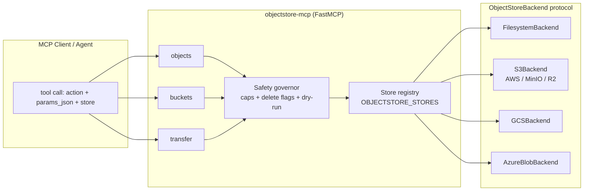

# Architecture

## Layers

| Layer | Module | Responsibility |
|---|---|---|
| Tool surface | `objectstore_mcp/mcp/mcp_objectstore.py` | Action routing, parameter parsing, text/base64 encoding, **all safety enforcement** (CONCEPT:OBJ-1.2/1.3) |
| Store registry | `objectstore_mcp/config.py`, `objectstore_mcp/auth.py` | `OBJECTSTORE_STORES` parsing, default-store resolution, per-store backend cache (CONCEPT:OBJ-1.1) |
| Backend protocol | `objectstore_mcp/backends/base.py` | The provider-neutral contract, dataclasses, error taxonomy, name/key validation (CONCEPT:OBJ-1.0) |
| Backends | `objectstore_mcp/backends/{filesystem,s3,gcs,azure_blob}.py` | Pure storage adapters; lazy SDK imports (CONCEPT:OBJ-1.4/1.5) |

## Design decisions

- **Backends are bucket-agnostic.** The bucket is a per-call argument;
  per-store default buckets are a tool-layer convenience. This keeps each
  backend a thin adapter and lets one store config span many buckets.
- **Safety lives in the tool layer, not the backends.** Backends accept a
  `max_bytes` hint for cheap pre-flight size checks, but every cap, flag,
  and dry-run decision is made once, uniformly, in `mcp_objectstore.py`.
  No backend can accidentally weaken policy.
- **Errors are translated, never leaked.** Provider SDK exceptions become
  the shared taxonomy (`NotFoundError`, `AlreadyExistsError`,
  `BucketNotEmptyError`, `UnsupportedOperationError`,
  `MissingDependencyError`), so the tool layer and tests treat all
  providers identically.
- **The filesystem backend is a first-class provider, not a mock.** It
  implements the full protocol (including metadata via `.meta/` sidecars and
  delimiter-folded pagination), which is what makes the conformance suite
  real coverage rather than mock theater.
- **Conformance over per-backend tests.** `tests/test_backend_conformance.py`
  is parametrized on the backend fixture; cloud adapters get focused
  translation tests with injected fake clients, plus an optional moto suite
  (`test-s3` extra).
